### a mente é a atividade do cérebro

---

### quatro fatos fundamentais

- seres humanos surgiram da seleção natural

- atividades mentais são um tipo de atividade cerebral

- a mente não uma coisa, é um conjunto de capacidades  
  (percepção, emoção, memória, imaginação, raciocínio, decisão, linguagem etc.)

- como o restante do corpo, a mente é cheia de gambiarras

---

### somos animais

- bioquímica e anatomia semelhantes às de outros animais.
- comportamentos básicos semelhantes aos de outros mamíferos   
  (apego materno, instinto de sobrevivência, desejo sexual etc.).
- mas nosso poder cognitivo é superior.
- mas há continuidades.

---

### não somos perfeitos
- órgãos vestigiais
- estruturas subótimas
- limites comportamentais
- limites cognitivos

---

### órgãos vestigiais

- mamilos masculinos inúteis
- pelos
- sisos
- apêndice
- cóccix
etc.

---

### estruturas subótimas

- sistema imunológico    
  (corrigido com vacinas e antibióticos)
- coluna vertebral
- trato respiratório
- sistema excretor
etc.

---

### limites comportamentais

- autocontrole imperfeito  
  (e ainda piora quando há medo, raiva, ciúme etc.)
- suscetibilidade a vícios
- altruísmo muito limitado
etc.

---

### limites cognitivos

- viés de confirmação
- memória contextual
- efeito de ancoragem
- efeito de enquadramento
- viés de representatividade
etc.

---

## surgimos da seleção natural

---

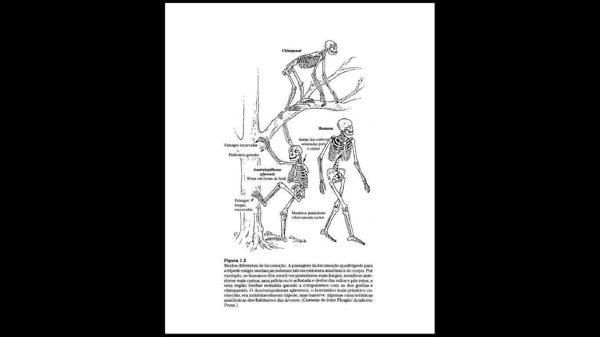

---

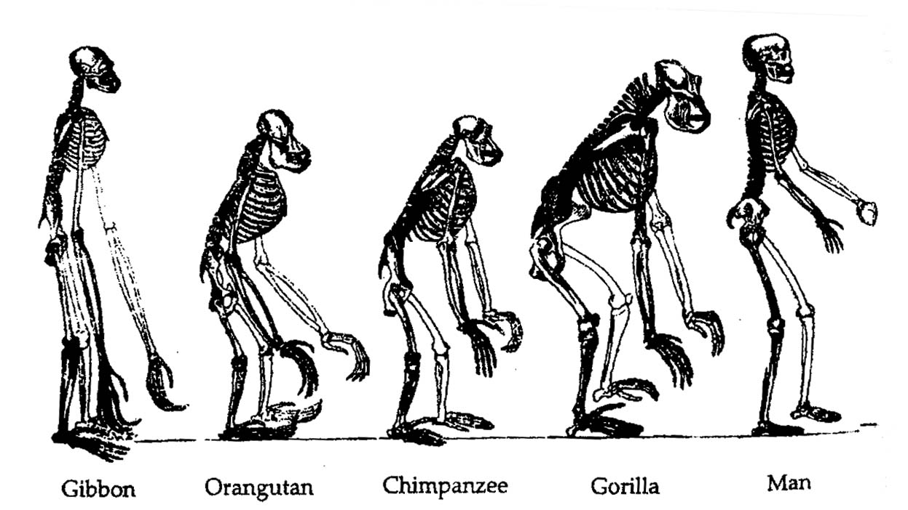

---

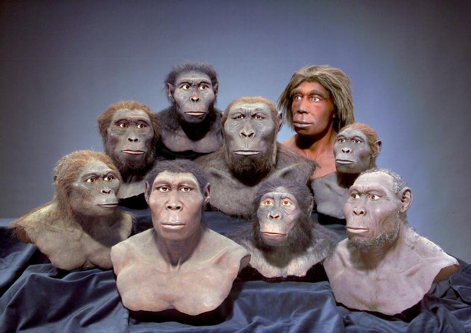

---

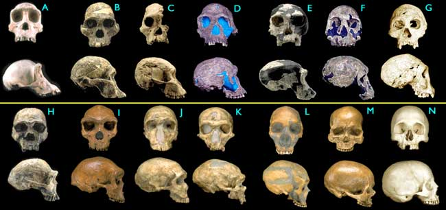

---

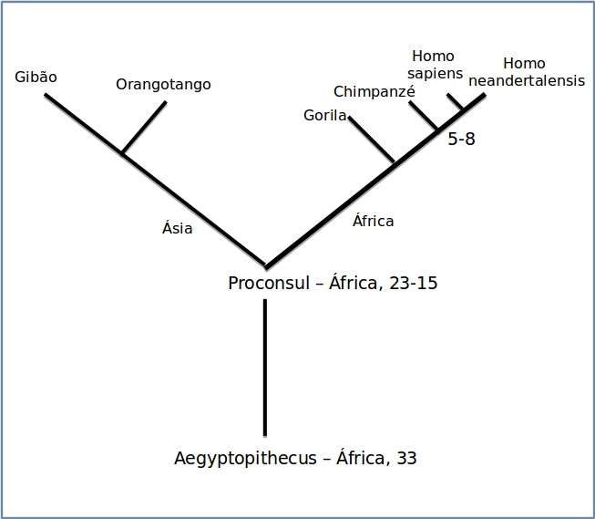

---

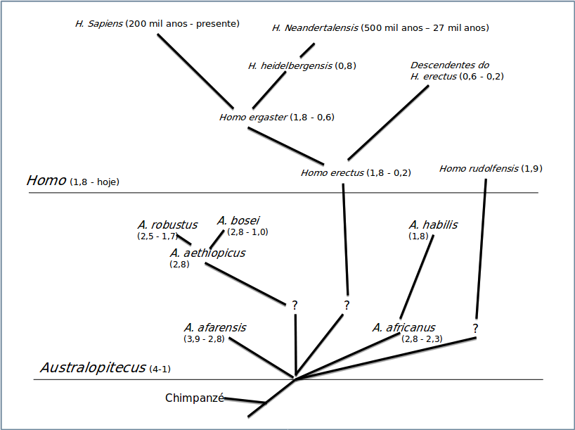

---

---

### religião

- João Paulo II:  “mais do que uma teoria”

- Bento XVI: evolucionismo e criacionismo são compatíveis.   
  Mas apenas a fé responde a "De onde vem tudo?”

---

## a mente é atividade do cérebro

---

---

#### Atividades mentais são atividades eletroquímicas do cérebro

**convergência**  de estudos   
(lesões, imagens, filogenia  e estimulações)  

- perda **seletiva** de capacidades mentais  
  (derrames, amnésia, Alzheimer, Parkinson, tumores etc).

- certas substâncias modificam a atividade mental   
  (cafeína, álcool, LSD, antidepressivos etc.)

- estimulação elétrica (direta e transcraniana)

- leitura de mentes: figuras e filmes

- interfaces cérebro-máquina

---

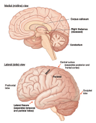
- 2% do peso, 20% da energia.
- Temos 24 mil genes, 8 mil se expressam apenas nele.

---

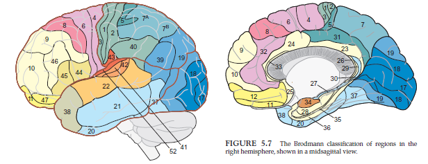

---

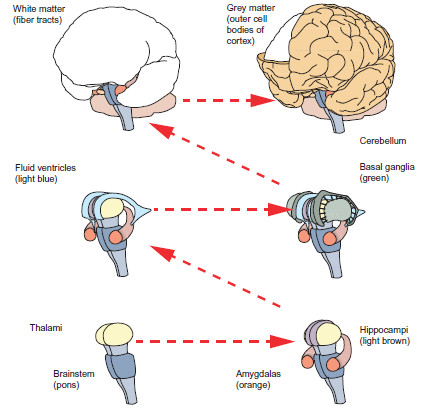

---

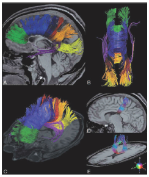

---

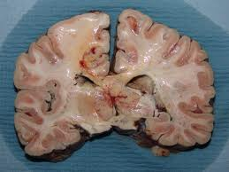

80 bilhões de neurônios (< cerebelo)
+- 10 mil sinapses por neurônio
60 trilhões de sinapses

---

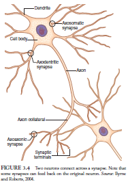

---

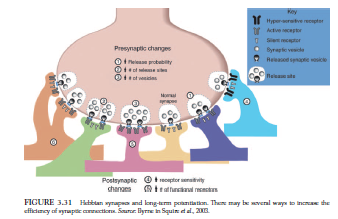

---

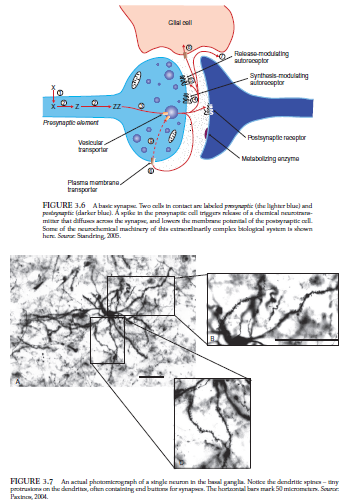

---

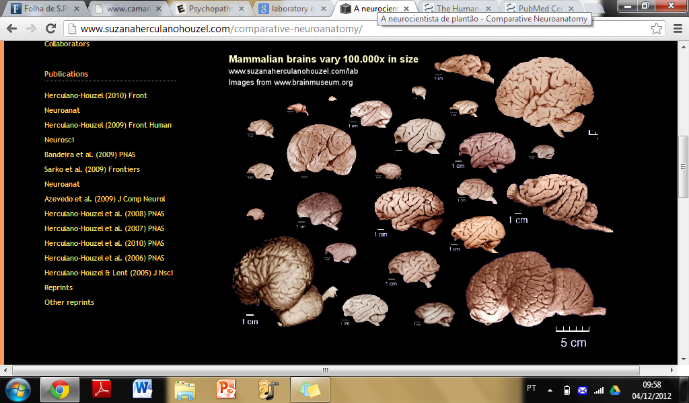

---

---

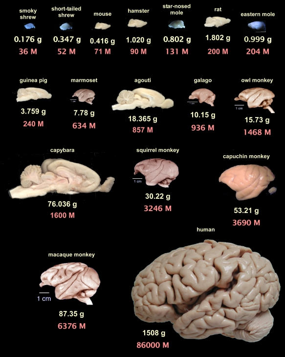

---

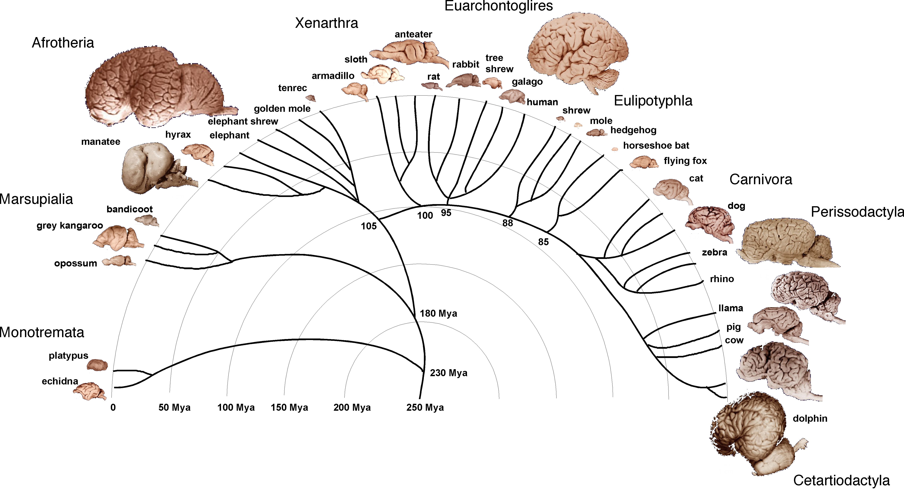

---

## lesões
Prejuízo a uma parte do cérebro causa prejuízo a uma parte da mente.

córtex visual/auditivo -> cegueira/surdez
derrame -> déficits cognitivos, motores
tumores -> mudanças comportamentais
hipocampo -> amnésias retrógrada, anterógrada, semântica etc.
amigdala -> déficits emocionais

Logo, a mente é a atividade do cérebro.
Além disso, a mente é complexa (modular), não simples (unitária).

---

## Imageamento funcional   
   (EEG, RMf etc.)

   Fluxos sanguíneos ou descargas elétricas diferentes em tarefas mentais diferentes.

   Logo,
   partes diferentes do cérebro realizam diferentes atividades mentais.
   a mente é a atividade do cérebro.     

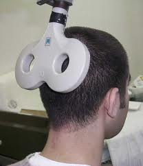

---

## Evidências filogenéticas

Animais com cérebros diferentes têm capacidades mentais diferentes.
Logo, para possuir certas capacidades mentais, é preciso possuir certos componentes e funções neurais.   

---

---

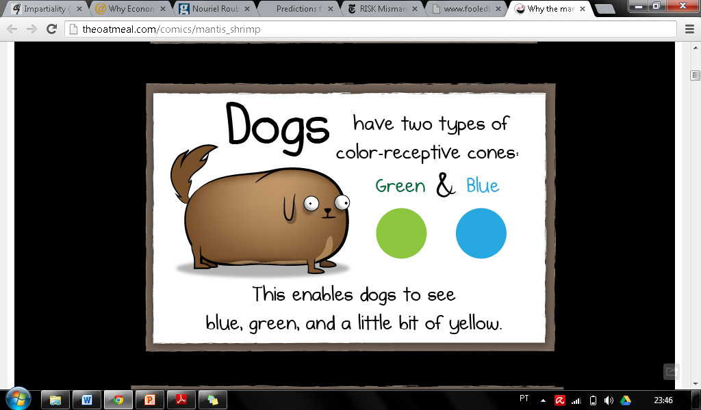

---

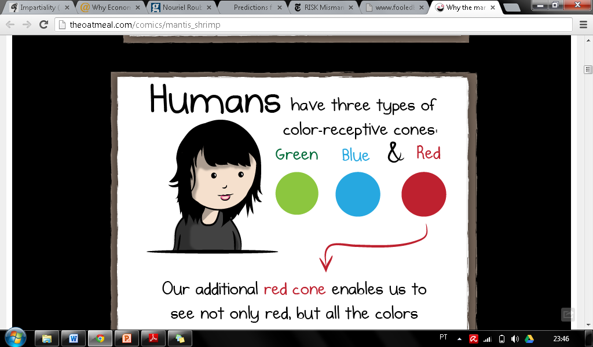

---

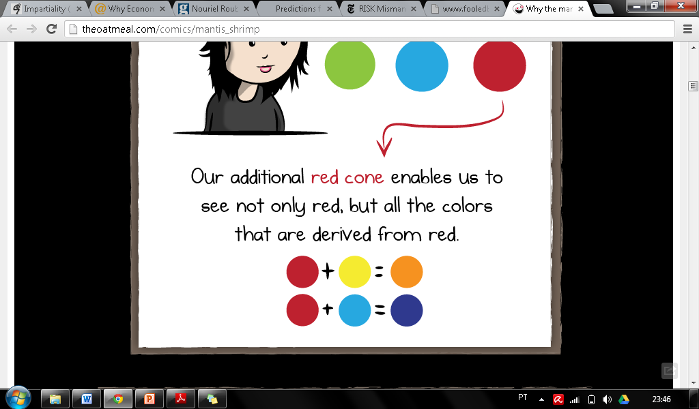

---

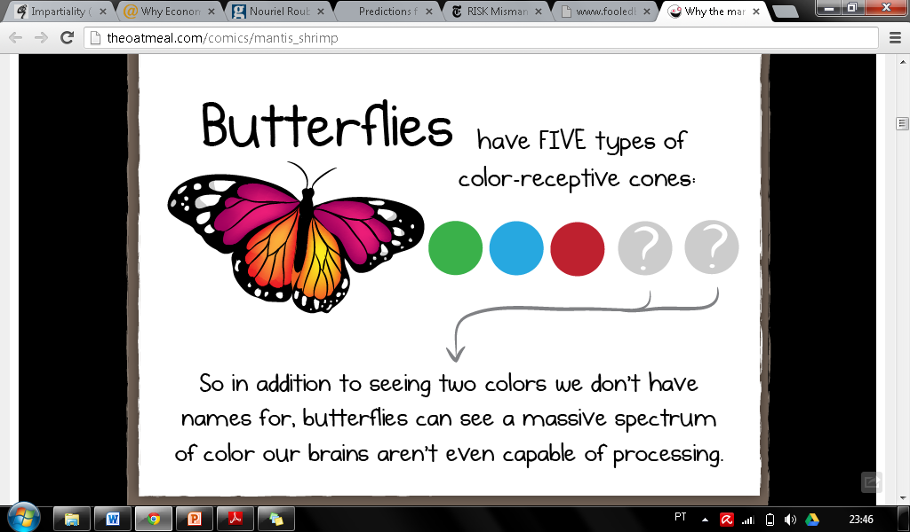

---

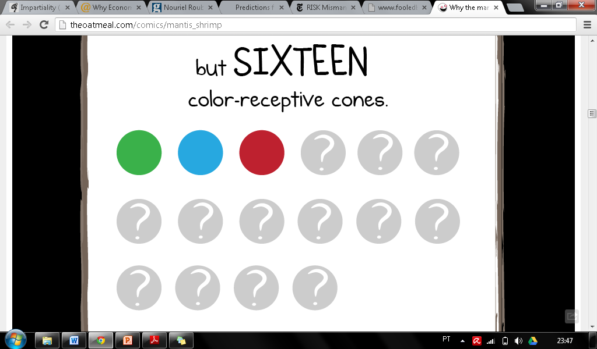

---

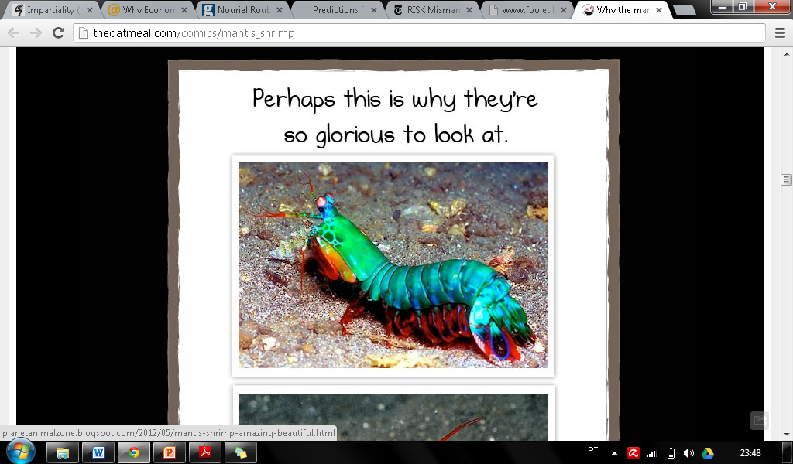

## Indo além da correlação

   Estimulação direta

   Interferências elétricas, químicas e magnéticas específicas no cérebro, interferem em atividades mentais específicas.

   Logo, a mente é
                o funcionamento eletroquímico do cérebro.

---

Mapa do córtex motor
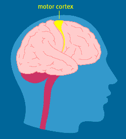

---

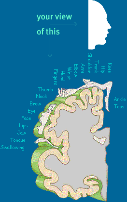

---

---

### ler a mente no cérebro

---

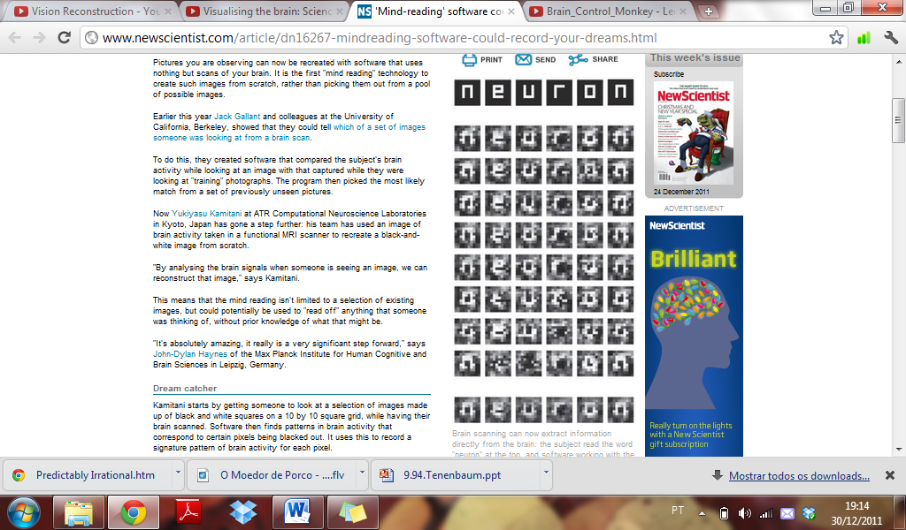

---

---

### controlando algo com o cérebro

---

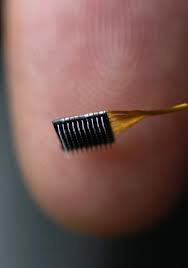

---

---

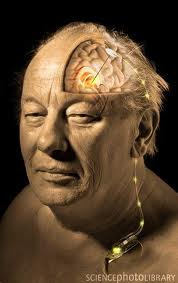

---

## considerações finais

- vários métodos (lesão, imagem, filogenia, estimulação) indicam que a mente é uma atividade cerebral.

- não sabemos tudo, mas nunca soubemos tanto.

- inversão do ônus da prova: o dualismo mente-corpo já não é respeitável como posição padrão.

- não há evento mental sem evento cerebral.
- a maior parte da atividade cerebral não é consciente.
- é possível alterar a mente alterando o cérebro.
- assim como todos os componentes de todos os organismos, o cérebro e a mente não são perfeitos, são cheios de gambiarras, heurísticas e vieses.
